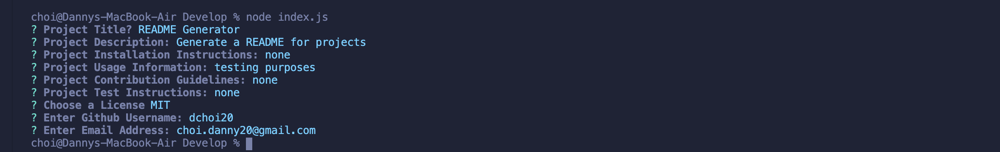
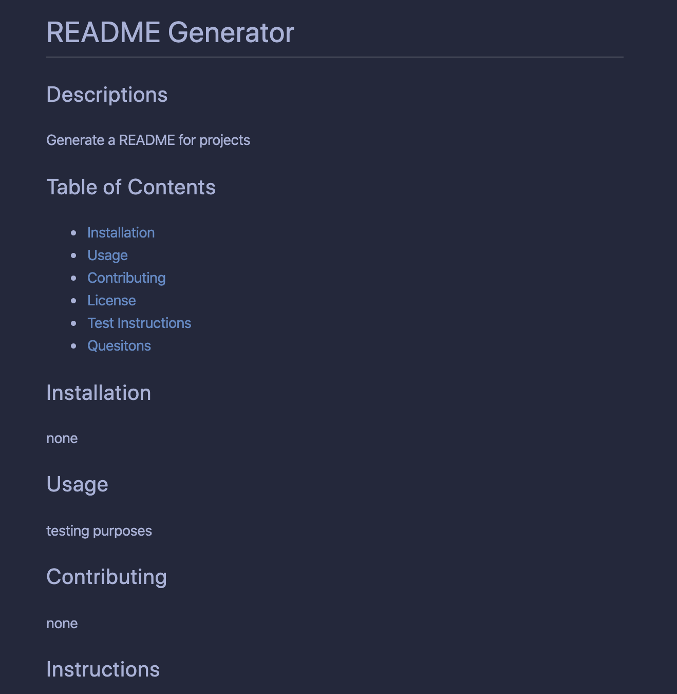

# README Generator

USER prompted a series of instructions on what information the user wants on their README.

## User Story

```
AS A developer
I WANT a README generator
SO THAT can quickly create a professional README for a new project
```

## Required

```md
GIVEN a command line application that accepts user input
THEN a quality README is generated based off of my input
WHEN I enter my inputs
THEN this information is displayed in the corresponding sections of the README
```

## EXAMPLE:




